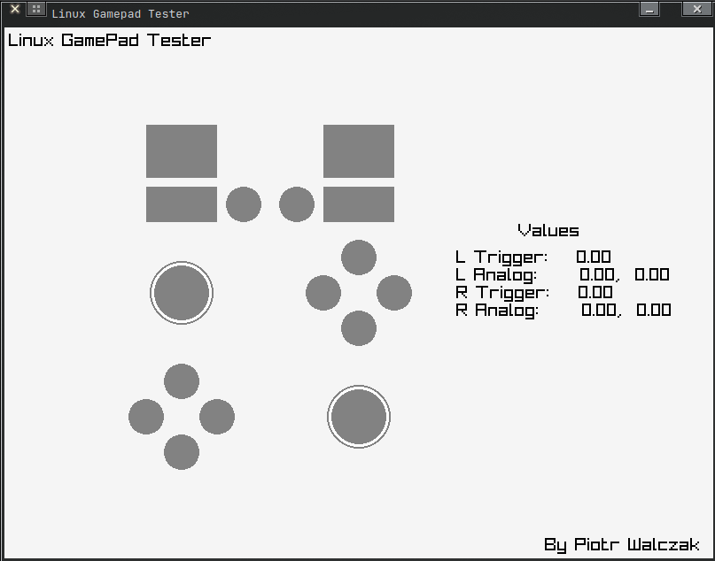

  

# Linux Gamepad Tester

  

This project was made to find and analise possible issues with a game controller (like XBox One) that is connected to your PC. It allows to determine if there are any problems visually and numerically.

## Dependencies

* [Raylib](https://github.com/raysan5/raylib) - simple library for easy GUI creation and input control

## How to build

* Install raylib or build it by yourself.
* In the project directory use `cmake .`
* Run generated Makefile (`./Makefile`).
* Run the program (`./LinuxGamepadTester`).

## Common Issues

* This project was meant to be used on linux, but it is possible to run it on windows. You only need to tweak a little bit CMakeLists.txt file.
* If you run the program and it tells you that no gamepad is connected there is a possibility that your gamepad is not supported (at least in GLFW3) or i didn't add the support for that gamepad (less possible).

## Contributing

Feel free to propose any changes. I will accept pull requests after analysing them.
If you have any suggestions, bug reports, or feature requests, feel free to open an issue on GitHub.
